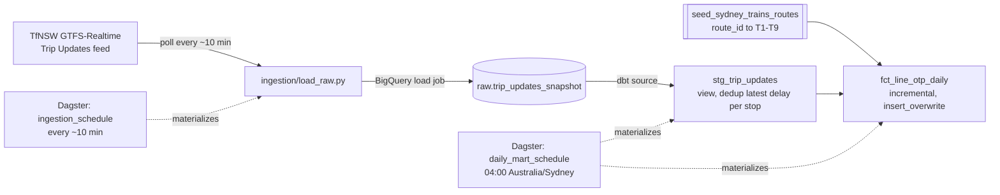

# TfNSW Transit Pulse

Daily on-time-running performance for Sydney Trains lines, built from
TfNSW's live GTFS-Realtime feed: Python ingestion into BigQuery, a dbt
staging + incremental mart layer, and Dagster orchestrating both on a
schedule, with CI running real dbt tests against a live BigQuery dataset
on every push.

This is a portfolio project. Scope is deliberately one fact table, not an
enterprise platform — see [What this does and doesn't prove](#what-this-does-and-doesnt-prove).

## Architecture



Two schedules, not one, because a single daily poll can't produce a real
daily on-time-running metric — it would only capture one instant. Ingestion
polls frequently all day; the mart is built once, after the prior service
day is fully captured.

## Repo structure

```
ingestion/          Python: fetch GTFS-RT, load raw BigQuery table
dbt/
  models/staging/   stg_trip_updates -- dedupe raw snapshots to one row
                     per (trip_id, stop_id, service_date)
  models/marts/     fct_line_otp_daily -- incremental daily OTP by line
  seeds/            Sydney Trains route_id -> line label snapshot,
                     plus a CI-only fixture seed under seeds/fixtures/
orchestration/       Dagster: asset graph (loaded from the dbt manifest)
                     and the two schedules
.github/workflows/   CI: dbt build --target ci against a real BigQuery
                     dataset seeded with fixture data
```

## Data model

- **Grain:** one row per `(service_date, route_short_name)` in
  `fct_line_otp_daily` — `route_short_name` is the rider-facing line code
  (T1–T9), not the raw GTFS `route_id` (which splits T1 into two branch
  route_ids that would otherwise show up as two different "lines").
- **On-time definition:** within 5 minutes (300 seconds) of scheduled
  arrival, matching TfNSW's own published OTR threshold. Falls back to
  departure delay when a stop's arrival delay wasn't reported.
- **Incremental strategy:** `insert_overwrite`, partitioned on
  `service_date`, with a 2-day reprocessing window on every run — the
  fact table is fully re-derivable per partition, so overwriting whole
  partitions is simpler and cheaper than a row-level merge, and the
  lookback absorbs snapshots that land after midnight due to ingestion
  timing rather than under-counting the prior day.
- **Tests:** grain uniqueness (`dbt_utils.unique_combination_of_columns`),
  `not_null` on required columns, `accepted_values` on the line code and
  the raw feed's schedule_relationship enum, and `accepted_range` sanity
  bounds on `avg_delay_minutes` and `pct_on_time`.

## Setup

### 1. TfNSW Open Data Hub API key

Register at [opendata.transport.nsw.gov.au](https://opendata.transport.nsw.gov.au)
and subscribe to the Sydney Trains GTFS-Realtime Trip Updates product.
TfNSW deprecated the old v1 Sydney Trains endpoint in May 2025 in favour of
a v2 feed — confirm the exact URL on your dashboard and set it as
`TFNSW_TRIP_UPDATES_URL` in `.env` if it differs from the default in
`ingestion/config.py`.

### 2. GCP project and service accounts

You'll need a GCP project with BigQuery enabled, and two service accounts
(least-privilege, not one shared account):

| Service account | Roles | Used by |
|---|---|---|
| ingestion | BigQuery Data Editor + BigQuery Job User, scoped to the `raw` dataset | `ingestion/*.py`, locally or wherever ingestion runs |
| ci | BigQuery Data Editor + BigQuery Job User, scoped to a dedicated `ci` dataset | GitHub Actions |

Create the `raw` dataset via `python -m ingestion.bootstrap_bigquery` (idempotent —
safe to re-run). Create the `ci` dataset once by hand; CI writes fixture
data into it on every run but doesn't create the dataset itself.

For local dev, download a JSON key for the ingestion service account and
point `GOOGLE_APPLICATION_CREDENTIALS` at it in `.env`. For CI, paste that
service account's JSON key into a GitHub repo secret named `GCP_SA_KEY`,
and add your project ID as a secret named `GCP_PROJECT_ID`.

### 3. Local environment

Requires Python 3.11 or 3.12 (Dagster/dbt don't yet support 3.13+).

```bash
python3.12 -m venv .venv
source .venv/bin/activate
pip install -e ".[dev]"
cp .env.example .env   # fill in TFNSW_API_KEY, GCP_PROJECT_ID, GOOGLE_APPLICATION_CREDENTIALS
cp dbt/profiles.yml.example dbt/profiles.yml
python -m ingestion.bootstrap_bigquery
```

### 4. Run it

```bash
# one ingestion poll
python -m ingestion.load_raw

# dbt, from the dbt/ directory
cd dbt && dbt deps && dbt build

# Dagster, from the repo root
dagster dev -m orchestration.definitions
```

## What this does and doesn't prove

**Does:**
- Real ingestion from a live external API into a cloud warehouse, not a
  static/sample dataset.
- A dbt staging + incremental mart layering with a deliberately chosen
  incremental strategy (`insert_overwrite` vs `merge`), not just switched
  on by default.
- Schema tests enforcing grain, ranges, and accepted values.
- Asset-based orchestration where the Dagster graph is generated from
  dbt's own lineage, not hand-maintained separately.
- CI that runs `dbt build` against a real BigQuery dataset on every push,
  not just a syntax/parse check.

**Doesn't:**
- Match TfNSW's official published OTR methodology — theirs reconciles
  against the full static GTFS schedule; this project trusts the
  realtime feed's self-reported delay field.
- Cover more than one feed — Sydney Trains only, not buses, ferries,
  light rail, or Metro.
- Include dimensional modeling beyond one manually-refreshed route seed.
- Do anomaly or data-quality monitoring beyond the dbt tests listed above.
- Use durable/streaming ingestion — this is polling on a schedule, not a
  message queue, so a missed polling window is simply missing data, not
  something the pipeline detects or backfills.
- Backfill history from before ingestion started — TfNSW's GTFS-Realtime
  feed is not queryable historically, so the fact table's history starts
  the day ingestion first ran.
